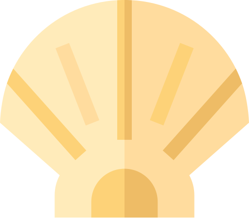
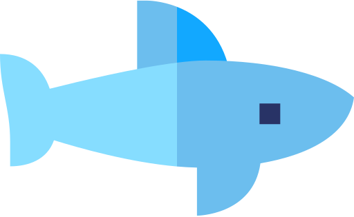

# Game Design Document

###### Kat R. | CS 439 - Game Engine Development

This project is for the "First Game" assignment in CS 439.
The description website URL directs to the Canvas assignment page.
If you have access, that is.

**This program requires the user to have `pygame` already installed.**

###### _If you're having trouble installing `pygame` via <kbd>pip</kbd> with Python 3.12 or later, use Python 3.11 to `pip install pygame`._

## Overview

Always A Bigger Fish is an arcade-style game in which the player controls a small fish.
In the game are many other non-controlled fishes of varying sizes, as well as some other animals.
The player must eat fish that are smaller than them and avoid _being eaten_ by fish _bigger_ than them.

When the player eats (collides with and deletes) a smaller fish, their size increases slightly depending upon the size of what they ate.
Likewise, when the player is eaten (collides with and _gets_ deleted), the game is immediately over.

The player's goal is to reach the biggest size they can within a 30-second\* round.
When the round is over--either by running out of time or by getting eaten--return to title screen.

###### \*subject to change.

## List of Assets: Sprites

| Sprite Class            | Visual Elements                                                                                                             | Animation Details                                                                                         | Lifespan                                                                | Movement                                                                                                                                         | Boundary Behavior | Collision Behavior                                                                                                                                                          |
| ----------------------- | --------------------------------------------------------------------------------------------------------------------------- | --------------------------------------------------------------------------------------------------------- | ----------------------------------------------------------------------- | ------------------------------------------------------------------------------------------------------------------------------------------------ | ----------------- | --------------------------------------------------------------------------------------------------------------------------------------------------------------------------- |
| GameSprite              | A superclass to hold code that is consistent across every subclass.                                                         | Flip along y-axis when moving right-to-left                                                               | N/A                                                                     | N/A -- the subclass must define its own movement.                                                                                                | CONTINUE          | None. Currently, the GameScene only enables collisions between Fish and the Player                                                                                          |
| GameSprite > Fish       | The "type" of fish is chosen randomly from a list of presets. Each "type" has a corresponding size, speed range, and image. | Inherit                                                                                                   | Until time runs out, or when eaten                                      | Fish move in a horizontal line from one edge of the screen to another. They spawn at a random y-level. Speed range differs based on fish "type." | Inherit           | Inherit                                                                                                                                                                     |
| GameSprite > Player     | A goldfish, will stand out. Harbors similar behavior to fish.                                                               | Inherit                                                                                                   | Inherit                                                                 | WASD or arrow keys. Drifts to a stop if in motion with no keys pressed.                                                                          | Custom (Inherit)  | If collides with any fish, scene runs a to see whose size is bigger. The bigger grows and the smaller fish is deleted. If collides with any collectible, increase own size. |
| GameSprite > Bird       | A seagull or a pelican. Have corresponding sizes.                                                                           | Bird image will point in movement direction                                                               | Inherit                                                                 | Birds swoop down from the top of the screen, diving into the water before returning upward beyond the top edge.                                  | Inherit           | Inherit                                                                                                                                                                     |
| GameSprite > Crustacean | A lobster, sea urchin, or crab. Corresponding sizes.                                                                        | When moving, rotates a little, ccw, before switching to cw, then ccw, then... imitates a sort of scuttle. | Inherit                                                                 | Scuttles up from bottom edge, waits, may or may not move sideways. Eventually returns downward beyond the bottom edge.                           | Inherit           | Inherit                                                                                                                                                                     |
| Collectible             | A conch, clamshell, or a nautilus shell.                                                                                    | Slowly rotates in a randomly chosen direction                                                             | Time needed to cross a boundary, or get collected. Despawns off-screen. | Slowly moves downward from the top edge of the screen to the bottom edge.                                                                        | Inherit           | If collides with player, player's size increases by a random value, no matter how small or big the player is. Despawns on contact.                                          |

## GUI Labels

| Scene     | Label             | Location                                                                | Appearance                                                                                  | Updates?                                                                                          |
| --------- | ----------------- | ----------------------------------------------------------------------- | ------------------------------------------------------------------------------------------- | ------------------------------------------------------------------------------------------------- |
| Main Menu | Title             | Top-Middle of screen, translated up slightly.                           | "Always A Bigger Fish", in a bold, large font.                                              | None                                                                                              |
| Main Menu | Author            | Just below Title                                                        | "by Kat R. for CS 439 \"First Game\""                                                       | None                                                                                              |
| Main Menu | Best Size         | Middle or slightly bottom-middle of screen, below the Title and Author. | "Best Size: {size}", moderately large font size                                             | After each game ends, updated with player size from game if bigger than the previous value.       |
| Main Menu | Cause of Death    | Below Best Size                                                         | "Cause of Death: {cause}", smaller than best size                                           | When best size updates, Cause of Death updates as well with the loss condition of that best game. |
| In-game   | Size/Score        | Top middle, shifted left                                                | "Current Size: {size}" moderately-sized font, white text                                    | When the player fish eats another fish (and size changes)                                         |
| In-game   | Time Left         | Top middle, shifted right                                               | "Time left: {time left:.2f}" with same style as above                                       | Every frame, pulls from a timer                                                                   |
| In-game   | Size-Up Indicator | Instantiated at fish position on size increase                          | "+{size increase}" in small, black text. This text briefly floats upward before despawning. | Position updated every frame until despawn, but text never updates.                               |

## Other GUI Elements

| Scene     | Element      | Location                     | Appearance                             | Purpose                                                 |
| --------- | ------------ | ---------------------------- | -------------------------------------- | ------------------------------------------------------- |
| Main Menu | Start Button | Bottom Middle, shifted left  | A rectangular button that says "Start" | Closes the Main Menu scene and opens the In-game scene. |
| Main Menu | Quit Button  | Bottom Middle, shifted right | A rectangular button that says "Quit"  | Closes the Main Menu scene and ends the program.        |

## Game/Scene Class Initialization

| Scene     | Appearance                                                                  | Sprites                                                                                                        | GUI Elements                                                      | Other Assets                                                                                                                                                                     |
| --------- | --------------------------------------------------------------------------- | -------------------------------------------------------------------------------------------------------------- | ----------------------------------------------------------------- | -------------------------------------------------------------------------------------------------------------------------------------------------------------------------------- |
| Main Menu | An underwater background with buttons and labels.                           | None                                                                                                           | 4 labels, 2 buttons. In class initialization.                     | Button click sound. In class init.                                                                                                                                               |
| In-game   | A different underwater background resembling a shallower area of the ocean. | Player, Fish, and Collectibles. Player in class init, fish and collectibles instantiated randomly during game. | 3 labels. 2 in class initialization, 1 instantiated on player eat | Timer, music, eat sound, collectible sound. Timer and music in class init. Eat sound instantiated for eat collisions; collectible sound instantiated for collectible collisions. |

## Game/Scene Class Behavior

| Scene     | Collision Management                                                                                                                                                                       | Sound Effect Triggers                                                                                                                     | Score & Timing Updates                                       | GUI Updates                                                                                          | Game End/Change Conditions                                                                                      |
| --------- | ------------------------------------------------------------------------------------------------------------------------------------------------------------------------------------------ | ----------------------------------------------------------------------------------------------------------------------------------------- | ------------------------------------------------------------ | ---------------------------------------------------------------------------------------------------- | --------------------------------------------------------------------------------------------------------------- |
| Main Menu | None. No sprites.                                                                                                                                                                          | Both buttons have a sound trigger on click.                                                                                               | None. No scorekeeping or timer.                              | After each game, checks and/or updates best size and best cause of death.                            | Play button closes menu scene and transitions to in-game scene. Quit button closes menu scene and ends program. |
| In-game   | Check for fish collision with player; on collision, affect player based on size. Check for collectible collision with player; always increases player size on collision. Runs every frame. | Fish-Player collision triggers eat sound. Collectible-Player collision triggers collectible sound. Ambient bubbling sounds play randomly. | Size score is updated on collision. Timer ticks every frame. | Score and timing updates reflect in labels. Any collision spawns an indicator that briefly despawns. | Game ends when either (1) the player fish is eaten for being too small, or (2) when the timer reaches 0.        |

## Asset List

Asset list will be updated as assets are added to the repo.

-   All or most graphics come from [this Flaticon pack](https://www.flaticon.com/packs/ocean-34).
-   All sounds come from [jsfxr](https://sfxr.me/).
-   Background image is from [this 2D Background pack](https://craftpix.net/freebies/free-underwater-world-pixel-art-backgrounds/) on Craftpix.
-   Music TBD.

| Asset                                                                                                                                                             | Attribution                                                                                                                                         | Usage                                                                                                                      |
| ----------------------------------------------------------------------------------------------------------------------------------------------------------------- | --------------------------------------------------------------------------------------------------------------------------------------------------- | -------------------------------------------------------------------------------------------------------------------------- |
|  `simpleGE` python module | Module made by [Andy Harris](https://github.com/twopiharris) from GitHub repository [twopiharris/simpleGE](https://github.com/twopiharris/simpleGE) | `pygame` abstraction layer; required for project.                                                                          |
|  `backdrop.png`                                                                                                     | [Image](https://craftpix.net/freebies/free-underwater-world-pixel-art-backgrounds/) from [Craftpix.net](https://craftpix.net/)                      | A background image for the game scenes.                                                                                    |
|  `bird_pelican.png`                                                                                              | Icon made by [Freepik](https://www.flaticon.com/authors/freepik) from [www.flaticon.com](https://www.flaticon.com/)                                 | Icon used for Pelican.                                                                                                     |
|  `bird_seagull.png`                                                                                              | Icon made by [Freepik](https://www.flaticon.com/authors/freepik) from [www.flaticon.com](https://www.flaticon.com/)                                 | Icon used for Seagull.                                                                                                     |
|  `collectible_clam.png`                                                                                      | Icon made by [Freepik](https://www.flaticon.com/authors/freepik) from [www.flaticon.com](https://www.flaticon.com/)                                 | Icon used for Clam.                                                                                                        |
|  `collectible_conch.png`                                                                                    | Icon made by [Freepik](https://www.flaticon.com/authors/freepik) from [www.flaticon.com](https://www.flaticon.com/)                                 | Icon used for Conch.                                                                                                       |
|  `collectible_nautilus.png`                                                                              | Icon made by [Freepik](https://www.flaticon.com/authors/freepik) from [www.flaticon.com](https://www.flaticon.com/)                                 | Icon used for Nautilus.                                                                                                    |
|  `collectible_seashell.png`                                                                              | Icon made by [Freepik](https://www.flaticon.com/authors/freepik) from [www.flaticon.com](https://www.flaticon.com/)                                 | Icon used for Seashell.                                                                                                    |
|  `crustacean_crab.png`                                                                                        | Icon made by [Freepik](https://www.flaticon.com/authors/freepik) from [www.flaticon.com](https://www.flaticon.com/)                                 | Icon used for Crab.                                                                                                        |
|  `crustacean_lobster.png`                                                                                  | Icon made by [Freepik](https://www.flaticon.com/authors/freepik) from [www.flaticon.com](https://www.flaticon.com/)                                 | Icon used for Lobster.                                                                                                     |
|  `crustacean_sea-urchin.png`                                                                            | Icon made by [Freepik](https://www.flaticon.com/authors/freepik) from [www.flaticon.com](https://www.flaticon.com/)                                 | Icon used for Sea Urchin.  <i>Also, I know a sea urchin isn't a crustacean.</i> |
|  `fish_butterfly.png`                                                                                          | Icon made by [Freepik](https://www.flaticon.com/authors/freepik) from [www.flaticon.com](https://www.flaticon.com/)                                 | Icon used for Butterfly Fish.                                                                                              |
|  `fish_shark.png`                                                                                                  | Icon made by [Freepik](https://www.flaticon.com/authors/freepik) from [www.flaticon.com](https://www.flaticon.com/)                                 | Icon used for Shark.                                                                                                       |
|  `player.png`                                                                                                          | Icon made by [Freepik](https://www.flaticon.com/authors/freepik) from [www.flaticon.com](https://www.flaticon.com/)                                 | Icon used for Player.                                                                                                      |

## Milestones

### Satisfactory for Submission

<ol>
   <del>
      <li>Set up the In-game scene with a backdrop and a (not yet functional) Player.</li>
      
<li>
         Player
         <ol type="i">
            <li>Keyboard control</li>
            <li>Drifting motion behavior</li>
            <li>Custom boundary action to force away from edge</li>
         </ol>
      </li>

      
<li>
         Fish
         <ol type="i">
            <li>Create trigger for a Fish to despawn off-screen</li>
            <li>Make Fish move horizontally past the edge of the screen</li>
            <li>Spawn at random y-levels at regular intervals with a variable speed also applied</li>
         </ol>
      </li>

      
<li>
         Fish collision logic
         <ol type="i">
            <li>If Player is bigger than the Fish, "delete" (reset) the Fish and increase player size</li>
            <li>If Fish is bigger, delete Player and trigger a game over</li>
            <li>Verify behavior with Fish</li>
         </ol>
      </li>

      
<li>
         Add "presets" for Fish
         <ol type="i">
            <li>An image, a speed range, and a size.</li>
            <li>Examples include a pufferfish, an orca, an angelfish, etc.</li>
            <li>Modify Fish spawning logic to randomly choose a preset</li>
            <li>Recycle "removed" fishes via respawning/resetting</li>
         </ol>
      </li>

      
<li>
         Create Bird presets mentioned in document
         <ol type="i">
            <li>Make the Bird come in from the top, swoop into the water, and continue swoop up off the edge.</li>
            <li>Collision logic is handled by GameScene</li>
            <li>Add random spawning mechanic</li>
         </ol>
      </li>

      
<li>
         Create Crustacean presets mentioned in document
         <ol type="i">
            <li>Extend GameSprite to use custom movement logic</li>
            <li>Make the crustacean scuttle in from the bottom edge, perhaps move sideways a short distance several times, and then scuttle back off the bottom edge.</li>
            <li>Collision logic is handled by GameScene</li>
            <li>Add random spawning mechanic</li>
         </ol>
      </li>

      
<li>
         Create Collectibles mentioned in document
         <ol type="i">
            <li>Quite simply, move down from the top edge and despawn past the bottom edge</li>
            <li>Implement collision logic to increase player size</li>
            <li>Make them spawn rarely and at random x-positions</li>
         </ol>
      </li>

      
<li>Add size and timer labels, complete with timer that exits the program when depleted</li>

   </del>
   
<li>Add size increase indicators</li>

   
<li>
      Create Main Menu scene
      <ol type="i">
         <li>Quit button to exit program</li>
         <li>Start button to run the In-game scene</li>
         <li>Best score and cause of death labels</li>
         <li>When the in-game scene ends, return size and cause of death to the Main Menu, which updates both values if this is a new best run</li>
      </ol>
   </li>

   
<li>
      Animations
      <ol type="i">
         <del>
            <li>Make Player Sprite look in movement direction, flipping the image horizontally when the fish would look upside down</li>
            <li>Make Birds point in movement direction. </li>
            <li>Make collectibles slowly spin</li>
         </del>
         <li>Make crustaceans rotate a little, back and forth, for a scuttling effect.</li>
      </ol>
   </li>

   
<li>
      Sounds
      <ol type="i">
         <li>Eating sound</li>
         <li>Collectible sound</li>
         <li>Button click sound</li>
         <li>Game over sound</li>
         <li>Ambient sounds?</li>
      </ol>
   </li>

   
<li>TBD UI details</li>

</ol>

### Extra Ideas

1. More fish presets
2. Different fish presets have unique sounds
3. Fish constructor follows builder design pattern (for readability of presets)
4. Intuitive logging system
5. "Diet" hitboxes (more accurate)
6. Weight the random preset algorithm to favor bigger fish as the player's size grows
7. Ambient/particle effects?
8. Game Over overlay in In-game scene. Lets players view the round's details before returning to Main Menu.
9. Joystick support

## Multi-State Considerations

The game runs the Main Menu scene.
From here, the Main Menu can exit the program or begin an In-game scene.
When the In-game scene exits, the Main Menu scene appears again.
This behavior will loop until the quit button is pressed.
